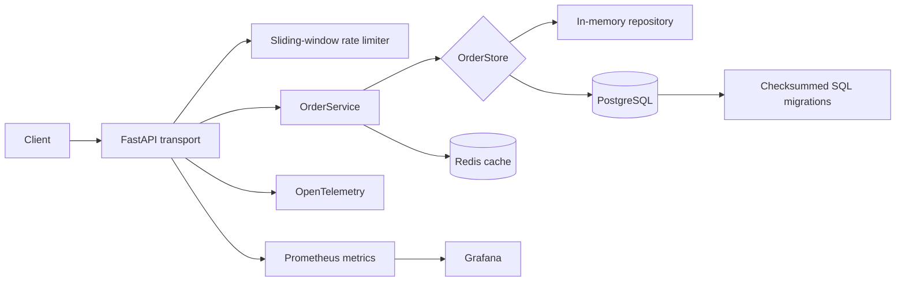

# API Backend Engineering Lab

A production-shaped FastAPI service built to demonstrate backend engineering concerns that are easy to hide in toy CRUD examples: concurrent idempotency, keyset pagination, cache-aside reads, versioned database migrations, rate limiting, observability, container packaging, and integration tests against real Postgres and Redis services.

The repository is intentionally small enough to study, but the boundaries mirror a larger service rather than concentrating business logic in route handlers.

## Architecture



### Request flow

1. FastAPI validates the HTTP contract.
2. The route delegates order behavior to `OrderService` rather than embedding persistence logic.
3. The service creates a domain `OrderRecord`, hashes the canonical request payload, and calls an `OrderStore` protocol.
4. The in-memory adapter serializes concurrent calls with an async lock. The Postgres adapter uses a transaction-scoped advisory lock for one idempotency key.
5. Successful reads and writes populate the optional Redis cache.
6. Keyset cursors encode `(created_at, order_id)`, avoiding offset drift when new rows are inserted.
7. HTTP latency/request metrics and OpenTelemetry instrumentation remain outside the domain layer.

## Package layout

```text
backend/
  api/
    orders.py           # HTTP routes only
    schemas.py          # Pydantic transport models
  domain/
    orders.py           # domain records and status values
  repositories/
    memory.py           # deterministic local adapter
  services/
    orders.py           # application orchestration + cursor codec
  contracts.py          # storage/cache protocols
  rate_limit.py         # reusable sliding-window limiter
storage/
  postgres.py           # asyncpg repository
  redis_cache.py        # Redis cache adapter
  migration_runner.py   # checksummed migration runner
  sql/001_orders.sql    # versioned schema
observability/           # Prometheus/Grafana configuration
loadtest/                # Locust workload
tests/                   # unit + real Postgres/Redis integration tests
app.py                   # composition root + legacy item demo
orders.py                # compatibility shim for older imports
```

`app.py` is now primarily a **composition root**. The order domain does not depend on FastAPI, Postgres, or Redis.

## Engineering behaviors

### Concurrent idempotency

`POST /v1/orders` accepts `Idempotency-Key`.

- Replaying the same key with the same canonical payload returns the original order and sets `Idempotency-Replayed: true`.
- Reusing the key with a different payload returns `409 Conflict`.
- The Postgres adapter obtains `pg_advisory_xact_lock(hashtextextended(key, 0))` inside the transaction before checking/inserting the idempotency record. Concurrent requests for unrelated keys do not share one global application lock.

### Keyset pagination

`GET /v1/orders` uses an opaque cursor derived from the ordered tuple `(created_at, order_id)`. The repository query applies the same tuple comparison and descending order, so pagination remains deterministic even when multiple orders share a timestamp.

### Cache-aside reads

`OrderService.get()` checks Redis first, falls back to the repository, then populates the cache. The service depends on a small `JsonCache` protocol rather than Redis directly, so unit tests can use deterministic fakes.

### Versioned migrations

`storage/migration_runner.py` discovers ordered SQL migrations and records their SHA-256 checksums in `schema_migrations`.

A previously applied migration whose contents later change is rejected instead of silently mutating schema history. The SQL files are included as Python package data so migrations remain available when the application is installed from a wheel.

### Deterministic service tests

`OrderService` accepts injectable clock and ID factories. Tests can therefore verify exact timestamps, IDs, idempotency behavior, pagination ordering, and cache semantics without monkeypatching global functions.

## API surface

| Method | Path | Purpose |
| --- | --- | --- |
| `GET` | `/health` | process health |
| `POST` | `/v1/orders` | create an order with optional idempotency |
| `GET` | `/v1/orders/{order_id}` | cache-aside lookup |
| `GET` | `/v1/orders` | customer filter + keyset pagination |
| `POST` | `/v1/items` | deliberately simpler compatibility/demo endpoint |
| `GET` | `/v1/items` | simple cursor demo |
| `GET` | `/metrics` | Prometheus exposition endpoint |

The `items` endpoints are retained as a compact baseline. The `orders` flow is the production-shaped path used to demonstrate the layered design.

## Run locally

### Full stack

```bash
docker compose up --build
```

Services:

- API: `localhost:8000`
- PostgreSQL: `localhost:5432`
- Redis: `localhost:6379`
- Prometheus: `localhost:9090`
- Grafana: `localhost:3000`

### Python development

```bash
python -m venv .venv
source .venv/bin/activate  # Windows: .venv\\Scripts\\activate
pip install -e ".[dev]"
pytest -q
uvicorn app:app --reload
```

## Validation gates

GitHub Actions runs the project as an installed package, not as an accidental source-tree import:

```text
editable package install
        ↓
pip dependency check
        ↓
Ruff
        ↓
unit tests
        ↓
Postgres + Redis integration tests
```

The branch additionally targets container validation with `docker compose config` and a real multi-stage image build.

Important test coverage includes:

- deterministic domain invariants
- idempotent replay and payload conflicts
- concurrent Postgres idempotency
- Redis cache integration
- equal-timestamp keyset pagination
- invalid cursor rejection
- sliding-window expiration and per-client isolation
- migration discovery/checksums
- authentication helpers
- HTTP endpoint behavior

## Container model

The Dockerfile uses two stages:

1. **builder** — builds the application and dependencies into wheels;
2. **runtime** — installs only from the wheel directory into a clean Python image, runs as a non-root user, and exposes an HTTP health check.

This verifies that the service works as an installable artifact instead of relying on the repository directory being on `PYTHONPATH`.

## Design trade-offs

This is a portfolio engineering lab, not a claim of a globally distributed commerce backend. Some deliberately bounded choices are:

- one Postgres database rather than sharding;
- process-local rate-limit state rather than a Redis/Lua distributed limiter;
- a simple cache-aside policy without stale-while-revalidate;
- schema migrations implemented in a compact local runner rather than Alembic;
- no message broker or transactional outbox because the current order workflow does not publish external events.

Those omissions are explicit so the repository demonstrates engineering decisions rather than accumulating infrastructure keywords without behavior behind them.
